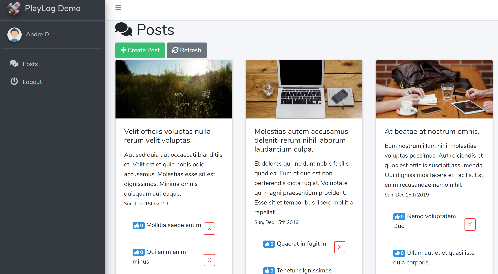

# Demo Social Project

A web application built with PHP and Laravel with VueJs and Bootstrap for the frontend. 

This application allows you to create a posting and add comments to your or other user's postings. 
All interaction is done with the cache and data is synced to database periodically. The frontend was written with VueJS so is extremely responsive after the application loads.
It also features a responsive layout thanks to Bootstrap.

- [PHP](https://www.php.net/)
- [Laravel](https://laravel.com)
- [VueJs2](https://vuejs.org/)
- [MariaDB](https://mariadb.org/)
- [Redis](https://redis.io/)
- [Bootstrap](https://getbootstrap.com/)
- [AdminLTE](https://adminlte.io/)

## Setup

## Laradock
- Copy the .env.example and updated database and caching values to match your setup. (`cp .env.example .env`)
- Spin up the environment with the command `docker-compose up -d apache2 php-fpm redis workspace`

### Application
- Copy the .env.example and updated database and caching values to match your setup. (`cp .env.example .env`)
- Connect the to workspace container 
- Install application PHP dependencies `composer install`
- Install application JS dependencies `npm install`
- Generate keys `php artisan key:generate`
- Setup database with the command `php artisan migrate`
- Open the application in your browser [http://localhost/](http://localhost/). (This will depend on your laradock setup)
- (Optional) Seed the database `php artisan db:seed`
- (Optional) If you seed the database, you will be about to login `admin@test.com` and `test123`

### Additional Steps
The database sync command is used to sync the cache data to the database. It can be ran manually with the command `php artisan db:save-cache` however, this can be automated by adding `* * * * * cd /path-to-your-project && php artisan schedule:run >> /dev/null 2>&1` to your `cron`. 

## Creator
Name: Andre Dixon

## Preview

